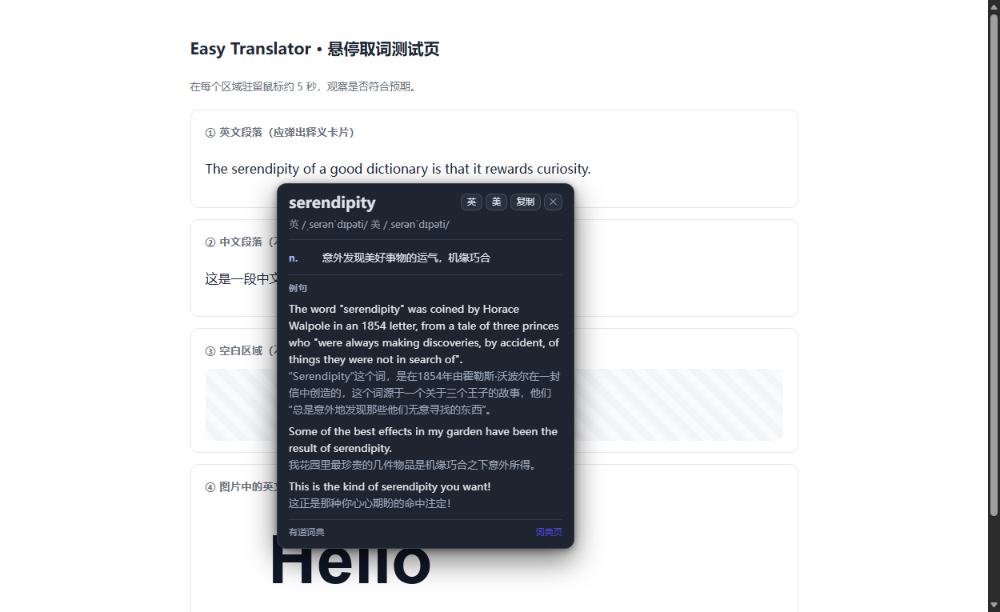
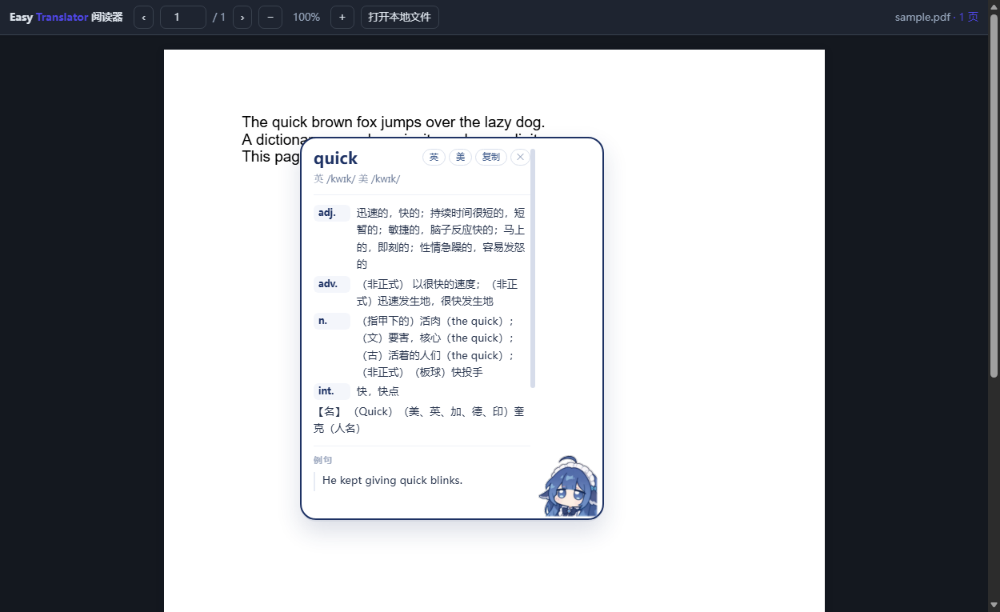

# Easy Translator · 悬停查词

[](https://github.com/Fishman-free/easy-translator/actions/workflows/verify.yml)

鼠标在英文单词上停留约 **5 秒**，自动弹出卡片：中文释义、英美音标、词性、双语例句、发音。



> 核心原则：**识别不到英文就绝不弹窗**。中文、数字、空白、乱码一律静默，不打断你的浏览。

支持三种「英文出现的地方」：

| 表面 | 方案 | 依赖 |
|---|---|---|
| 网页文本 | 浏览器原生取词（精确到字符） | 无 |
| **PDF** | 内置基于 pdf.js 的阅读器（Chrome 自带 PDF 阅读器是封闭页面，任何扩展都注入不进去） | 无 |
| **图片里的文字** | 截屏裁剪光标周边 → 本地视觉小模型识别 | 需授权 + 视觉模型 |

## 特性

- **双引擎**：在线词典（有道公开接口，免 key、国内直连）/ 本地小模型（Ollama 等任何 OpenAI 兼容端点）
- **轻量**：无构建、无依赖、无框架，扩展本体不到 100 KB；PDF 阅读器自带 3.5 MB pdf.js 运行时
- **隐私**：查词结果只缓存在本机；图片识别全程在本机模型完成，不外传
- **不污染页面**：卡片渲染在 closed shadow DOM 内，宿主页面的 CSS 影响不到它；取词脚本出错时静默退出
- **严格准入判定**：`isEnglishWord()` 是全项目唯一闸门，所有通道（网页 / PDF / 视觉模型）都必须过这一关

## 安装

### 从商店安装（推荐）

Microsoft Edge 商店：**提交审核中**，上架后这里会补上商店链接。

> 打包与提交所需的全部内容（可直接复制的商店文案、逐项权限理由、给审核员的测试说明）
> 见 [`store/SUBMISSION.md`](store/SUBMISSION.md)；隐私声明见 [`PRIVACY.md`](PRIVACY.md)。

### 从源码加载（开发者模式）

1. 克隆或下载本仓库
2. Chrome / Edge → `chrome://extensions` → 打开「开发者模式」→「加载已解压的扩展程序」→ 选择本目录
3. 打开任意英文网页，把鼠标停在一个单词上约 5 秒

> 首次安装后悬停即可工作（默认走在线词典，零配置）。

## 引擎配置

### 默认：在线词典

使用有道公开的词典 JSON 接口，无需 API Key。请求只发送被查询的单词本身，不发送页面内容或浏览记录。

### 可选：本地小模型（隐私优先 / 离线）

```bash
ollama pull qwen2.5:1.5b     # 文本查词，约 1 GB
ollama pull qwen2.5vl:3b     # 图片取词（可选），约 3 GB
```

在扩展「设置」页勾选 **启用小模型** 即可。

两个已处理的坑：

- **403 问题**：Ollama 默认拒绝浏览器扩展来源。本扩展用 `declarativeNetRequest` 只对自身发往 `127.0.0.1` / `localhost` 的请求剥离 `Origin` 头，**无需手动配置 `OLLAMA_ORIGINS`**；规则通过 `initiatorDomains` 限定为本扩展，不影响网页自身的请求。
- **冷启动问题**：CPU 上首次加载模型可能要 1–3 分钟（实测 113 秒）。设置页提供了「**预热模型**」按钮，加载完成后每次查词仅需数百毫秒。

## 图片文字取词

1. 在扩展弹窗点击「授权」，授予「所有网站」权限（用于截屏与跨站 PDF）
2. 设置好视觉模型（默认识别 `qwen2.5vl:3b`）
3. 鼠标在图片上停留约 1.5 秒 → 截取光标周边区域 → 本地视觉模型识别 → **识别到英文才查词**

识别不到英文时不会显示任何弹窗；同一个位置 10 分钟内不会重复尝试（负缓存），避免骚扰。

> 这条链路已纳入端到端测试：正样本（图片里的英文）应识别并查词，负样本（纯中文图片）应完全静默。
> 测试用一份「预授权」的扩展副本绕开无法自动化的权限弹窗。

## PDF 取词



Chrome 内置 PDF 阅读器无法被注入，因此本扩展内置了一个基于 pdf.js 的阅读器：

- 打开 PDF 时扩展图标会出现 **PDF** 标记 → 点开扩展 → 「用增强阅读器打开」
- 设置页可开启「自动用内置阅读器打开 PDF 链接」
- 本地 PDF 文件可直接拖进阅读器页面；阅读器支持翻页、缩放、`#page=N` 跳转

## 使用技巧

| 操作 | 行为 |
|---|---|
| 停留鼠标 | 到时间后弹出卡片 |
| 移开鼠标 | 卡片自动收起 |
| `Esc` | 立即关闭卡片 |
| 鼠标移到卡片上 | 卡片保持，可点发音 / 复制 / 打开词典页 |

## 开发

```bash
npm run verify:all      # 本地总验证：结构 + 单测 + 端到端 + 仓库状态 + 远端 CI 结论
npm run verify          # 一键：结构校验 + 单元测试 + 端到端（CI 用的就是这条）
npm run check           # 结构校验：manifest 合法性、引用文件存在性、首方 JS 语法、关键资源非空
npm test                # 单元测试（25 项：英文判定 / 取词边界 / 响应归一化 / 模型输出容错 / 工具链）
npm run test:e2e        # 端到端：headless Edge/Chrome 真机加载扩展 + CDP 派发真实鼠标事件
npm run screenshot      # 开发用真机截图（docs/screenshot-*.png）

npm run build:store         # 打包成可提交商店的 zip（自建 ZIP 写入器，避免反斜杠路径问题）
npm run build:store -- --smoke   # 额外把「解压后的这份包」真机跑一遍端到端
npm run store:screenshots   # 生成商店截图（1280x800，会从 PNG 文件头校验真实尺寸）

python tools/make-store-assets.py   # 商店图标 300x300 + 宣传图 440x280 / 1400x560
python tools/make-assets.py         # 扩展图标与视觉测试图
python tools/make-test-pdf.py       # PDF 测试夹具
python tools/make-demo-pdf.py       # 商店截图用的演示 PDF
```

> `npm run verify:all` 另有 `--no-e2e`（跳过真机测试，秒级自查）与 `--no-ci`（离线时跳过远端查询）。
> 找不到浏览器时可用 `ET_BROWSER=/path/to/chrome npm run test:e2e` 显式指定；
> 浏览器发现顺序见 `tools/lib/browser.mjs`（Windows / macOS / Linux 均已覆盖）。

E2E 覆盖的场景（本机 23 项 / CI 20 项，全部通过才算可交付）：

```
✔ 内容脚本注入（隔离世界已创建）
✔ 悬停中文：不弹窗
✔ 悬停空白：不弹窗
✔ 悬停英文：弹出卡片（word / source 均正确）
✔ 悬停后光标持续小幅漂移：卡片仍在（真实鼠标永远不会完全静止）
✔ 卡片被收起后，光标仍停在同一词上继续微动 → 卡片自行恢复（不再卡死）
✔ 页面无 JS 异常
✔ 网页跨源请求仍带 Origin（证明 DNR 规则未误伤网页自身请求）
✔ popup / options 页面正常渲染且无 JS 异常
✔ 内置 PDF 阅读器渲染文本层并可悬停查词
✔ 已注册「剥离 Origin」的 DNR 规则
✔ 小模型查词链路连通（浏览器内真实 200）
✔ 图片中的英文可识别并查词（图片 OCR 端到端）
✔ 图片中没有英文时不弹窗（负样本回归）
```

CI（`.github/workflows/verify.yml`）在 push / PR 时于 `ubuntu-latest` 上跑完整验证，
浏览器自动发现（runner 上实测使用 `/usr/bin/microsoft-edge`），无需额外配置。

> 依赖本机模型的三项（小模型查词、图片取词正/负样本）在**本机装有对应模型时自动运行**，
> CI 没有 Ollama 时会打印 `⚠ 跳过` 并少算这几项，而不是判失败。
> 图片取词测试用一份「预授权」的扩展副本（仅测试时生成）模拟用户点过「授权」后的状态。

## 目录结构

```
manifest.json          MV3 清单
background.js          Service Worker：引擎调度 / 缓存 / 图片取词流水线 / PDF 探测
lib/
  settings-core.js     设置读写（SW、弹窗、设置页、内容脚本共用）
  normalize.js         纯函数：英文判定、取词、响应归一化、模型输出容错
content/
  hover-core.js        悬停状态机 + 卡片（网页与 PDF 阅读器共用）
  content.js           网页内容脚本入口
  card.css             卡片样式（注入 shadow DOM）
popup/ options/        弹窗与设置页
pdf/                   内置 PDF 阅读器（pdf.js）
pdfjs/                 pdf.js 运行时（build / cmaps / standard_fonts）
tests/                 单元测试 + 夹具 + 手动测试页
tools/                 构建与验证脚本
  lib/browser.mjs      浏览器发现（跨平台）与无头启动参数
  lib/cdp.mjs          极简 CDP 客户端（e2e / 截图共用）
  e2e.mjs              真机端到端（支持 ET_EXT_DIR 指向商店包）
  verify-all.mjs       本地总验证入口
  build-store.mjs      商店打包（自建 ZIP 写入器 + 结构自检 + 可选真机冒烟）
  store-screenshots.mjs 商店截图（1280x800，校验真实尺寸）
store/                 上架材料：SUBMISSION.md、图标/宣传图、demo 页与 demo PDF（zip 产物不入库）
```

## 设计取舍

- **空白处不取词**：光标落在词间空格上不会触发（宁可漏，不误报）
- **只认纯 ASCII 英文词**：`café`、`naïve` 等带变音符号的词不触发；`don't`、`well-known`、`XML` 正常
- **单字母词不触发**：`a`、`I` 这类太容易误触
- **有选区时不触发**：避免和划词翻译/复制操作打架
- **图片识别默认开启但需显式授权**：不授权就完全不会截屏

## 隐私说明

- 网页/PDF 取词：只把**单词**发给词典接口（或本机模型）
- 图片取词：只把**光标周边的裁剪图**发给本机视觉模型，不经任何第三方服务器
- 缓存只存本机 `chrome.storage.local`，可在设置页一键清空

完整声明见 [`PRIVACY.md`](PRIVACY.md)。

## 上架商店

打包、商店文案、权限理由、审核测试说明与素材规格都在 [`store/SUBMISSION.md`](store/SUBMISSION.md)。
素材与截图可由 `npm run build:store`、`npm run store:screenshots`、`python tools/make-store-assets.py` 直接再生。

## 许可

MIT
